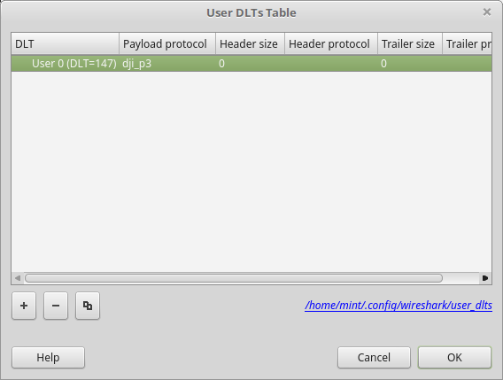
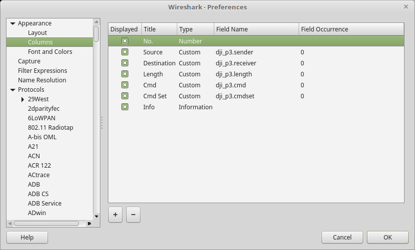
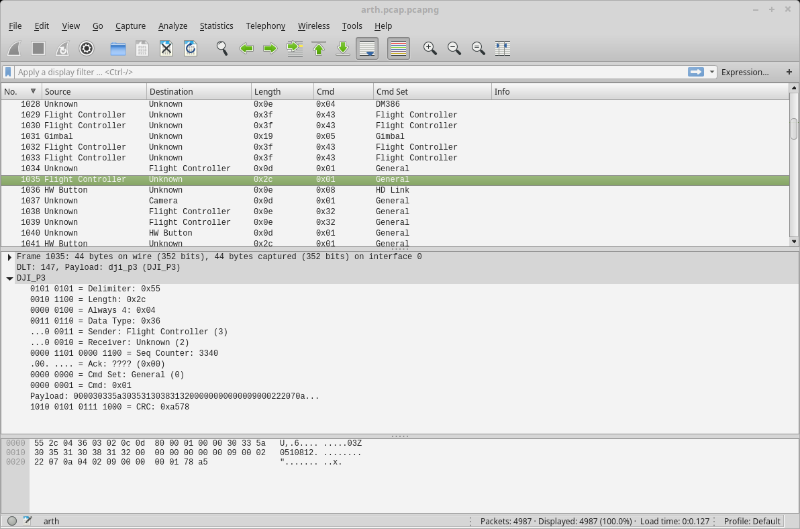

# dji-firmware-tools communication dissector

Utility for analyzing communication in DJI drone interfaces via [Wireshark](https://www.wireshark.org/).

## Rationale

This is a [packet dissector](https://www.wireshark.org/docs/wsdg_html_chunked/ChapterDissection.html) which allows you
to view and analyze serial communication on interfaces within the DJI drones. It can also understand packets used
within binary Flight Record DAT files. There is also a KML export plugin for visualizing the flight.
The dissectors act as documentation on what is known about the DJI protocols, in form of simple LUA code.

## Setup

A simple setup is required to use the new dissector.

### Copy the script files

Copy all the files LUA files (`*.lua`) and to the Wireshark profile directory. If you already different `init.lua` there, merge the content.

#### Copying files in Linux

The directory usually is `~/.config/wireshark`. If unsure, check [directories chapter in official documentation](https://www.wireshark.org/docs/wsug_html_chunked/ChAppFilesConfigurationSection.html).

#### Copying files in Windows

The directory usually is `C:\Users\<username>\AppData\Roaming\Wireshark`.  Check [directories chapter in official documentation](https://www.wireshark.org/docs/wsug_html_chunked/ChAppFilesConfigurationSection.html)
and a special chapter for Windows folders if unsure.

### Associate comm_*2pcap output to new dissector

Now we need setup Wireshark to associate the `*.pcap` files generated by `comm_*2pcap.py` capture script with proper protocol dissector.

First, it would be nice to have a list of existing payload protocol names. Find it by checking `Proto ()` definitions within LUA files. You will find protocols for specific platforms, and more generic ones. There will also be distinction between communication protocols and flight record log protocols. You can list them using:
```
grep -R 'Proto [\(]' ./wireshark/
```
For example, you will get three different protocols for Phantom 3 drones: `dji_p3`, `dji_p3_batt` and `dji_p3_flyrec`; first is for DUML communication, second for battery-to-fc communication, and third for dissecting DAT logs. But you will also get generic DUML protocol dissector, `dji_dumlv1`. Now to associate the protocols with PCap files:

* Start Wireshark

* Choose Edit | Preferences | Protocols

* Scroll down to DLT_USER

* Click Edit, create a new entry (‘+’) and set it up, similar to how it is shown below:

  * Select DLT_USER slot you prefer, 0-15; you will use that slot when creating PCAP files
 
  * Associate the slot with the payload protocol you want, ie. `dji_dumlv1`

  * Repeat until you associate all the needed protocols



If you're using multiple DLT_USER dissectors, remember that you can set `comm_*2pcap.py` parameter to change the user slot while generating PCap file.

### Update columns in list of packets (optional)

You may also want to setup Wireshark’s main display columns:

* Choose Edit | Preferences | Columns

* Setup as shown below



Having your own column definitions will greatly increase readability of the packets list.
 
## Usage

After setup is complete, you can load pcap files and get results like this:



You can now analyze DJI communication protocols.
